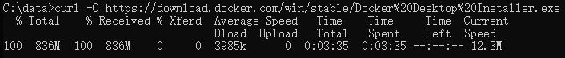
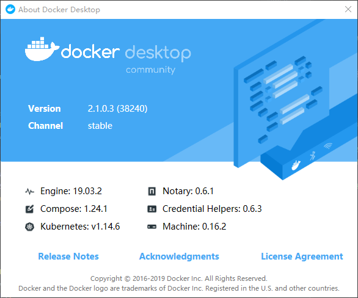
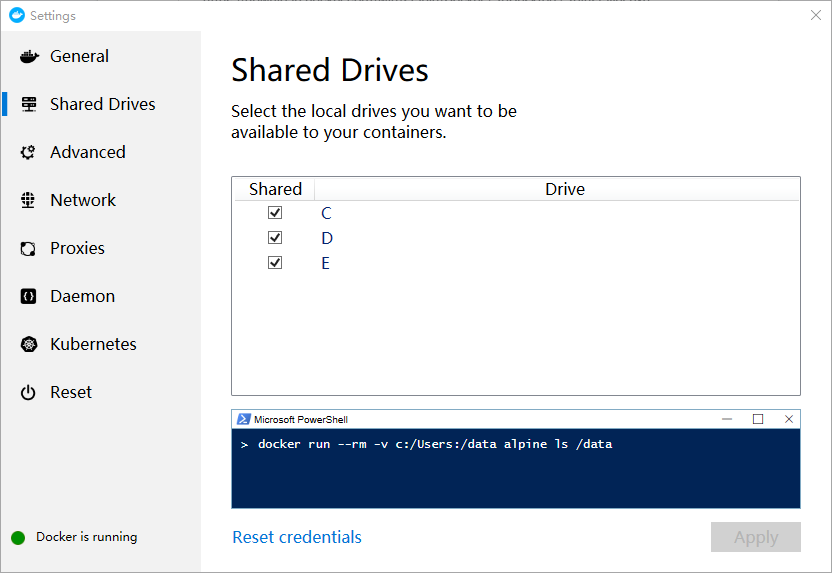
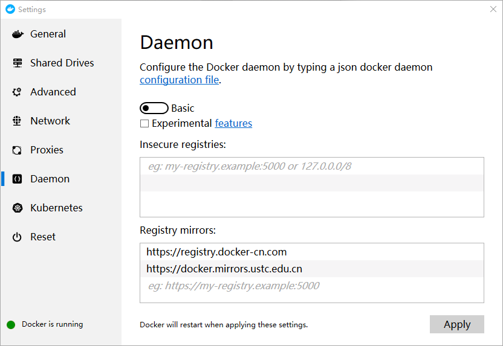
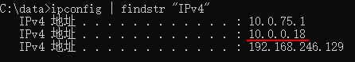
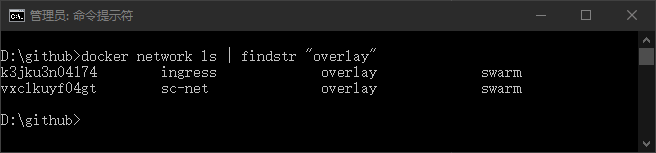

# 在 Windows 10 专业版系统中使用 Docker Desktop Community for Windows 部署环境

## 安装 Docker Desktop

* 下载 [Docker Desktop Installer.exe](https://download.docker.com/win/stable/Docker%20Desktop%20Installer.exe) 并安装

    ```bat
    curl -O https://download.docker.com/win/stable/Docker%20Desktop%20Installer.exe
    ```

    
    

* 设置共享目录

    

* 配置镜像加速地址

    

* 配置镜像加速地址（假如使用的是 Windows 10 非专业版及 Docker Toolbox）

    ```bat
    docker-machine ssh default 
    ```

    ```bash
    # 在 default 容器中执行
    sudo sed -i "s|EXTRA_ARGS='|EXTRA_ARGS='--registry-mirror=https://docker.mirrors.ustc.edu.cn |g" /var/lib/boot2docker/profile 
    sudo reboot
    ```

    ```bat
    docker info
    ```

* 初始化 swarm 网络

    ```bat
    ipconfig | findstr "IPv4"
    ```

    

    ```bat
    docker swarm init
    docker node ls
    for /F %i in ('docker node ls -q') do (set NODE_ID=%i)
    docker node update --label-add host=dev %NODE_ID%
    docker inspect %NODE_ID%
    docker node ls -f "label=host"
    docker network create ^
        --attachable ^
        --subnet 10.0.1.0/24 ^
        --driver overlay ^
        sc-net
    docker network ls | findstr "overlay"
    docker network inspect sc-net
    ```

    

* 测试服务创建、网络连接情况

    ```bat
    :: 查找镜像
    docker search -f "is-official=true" -f "stars=3" alpine

    :: 下载 node 并安装
    curl -O https://nodejs.org/dist/v12.13.0/node-v12.13.0-x64.msi
  
    :: 通过 npm 安装一个 json 格式化的工具，便于查看返回数据
    npm install -g json

    :: 列出镜像版本
    curl -s https://registry.hub.docker.com/v1/repositories/alpine/tags | json | findstr name

    :: 创建 helloworld 服务
    docker service create ^
        --replicas 1 ^
        --name helloworld ^
        --network=sc-net ^
        alpine:3.8 ^
        ping www.baidu.com

    :: 查看 helloworld 服务分布情况
    docker service ps helloworld

    :: 查看 helloworld 服务详情
    docker service inspect --pretty helloworld

    :: 调整 helloworld 服务的实例数量为3个
    docker service scale helloworld=3

    :: 滚动更新 helloworld 服务
    docker service update --image alpine:3.9 helloworld
    docker service update --image alpine:3.10 helloworld
    docker service logs -f helloworld

    :: 删除 helloworld 服务
    docker service rm helloworld

    :: 清除不再使用的镜像、容器（谨慎使用）
    docker image prune
    docker container prune
    ```

## 获取 SpringCloud 项目的 git 代码

* 执行脚本

    ```bat
    git clone -b dev git@github.com:zhoutaoo/SpringCloud.git d:\github\SpringCloud
    ```

## 启动基础服务

* 安装，启动服务

    ```bat
    cd /d d:\github\SpringCloud\docker-stack-deploy
    install.cmd
    ```